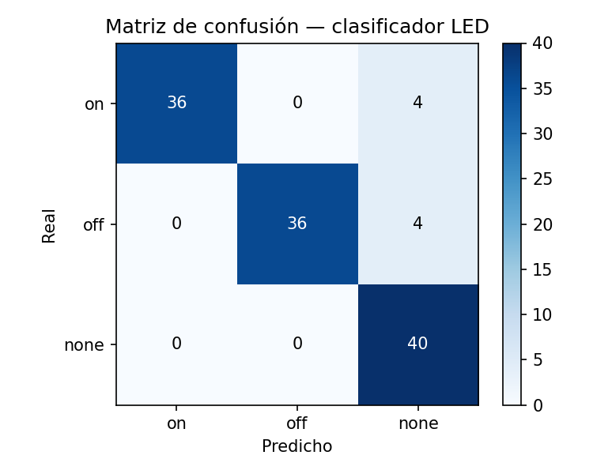
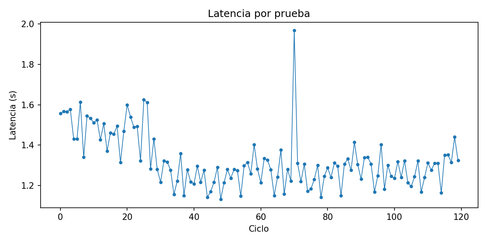
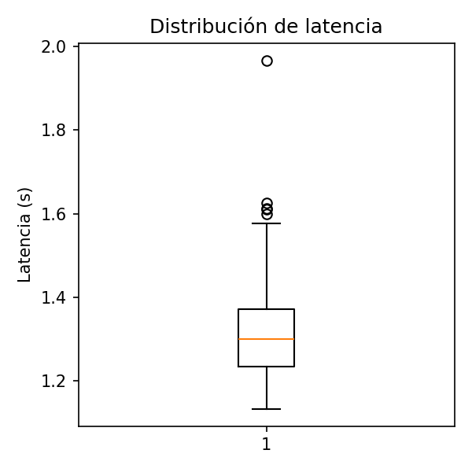
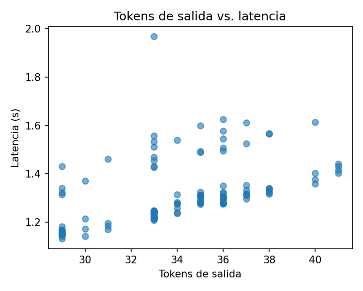
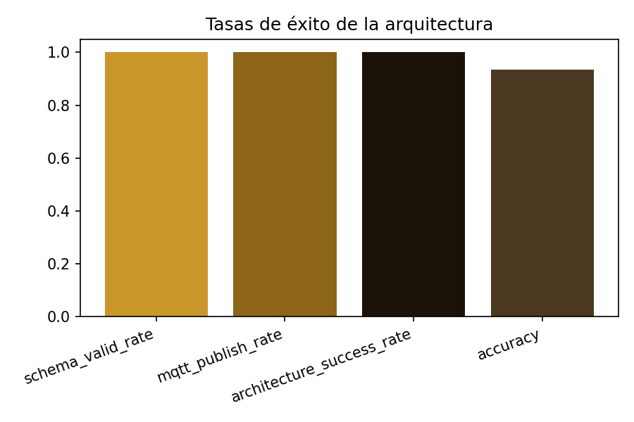

# Práctica 6 – Evaluación de Arquitecturas LLM: Clasificación de Instrucciones + MQTT

| | |
|---|---|
| **Modalidad** | Equipo |
| **Integrantes** | Jose Luis Macedo Escamilla · Fernanda Torres Abaroa · Alfredo José Mérida López |
| **Fecha** | Junio 2026 |
| **Curso** | IA Generativa — IBERO |
| **Profesor** | Huber Girón |
| **Herramientas** | Python 3 · FastAPI · Ollama · paho-mqtt · pandas · scikit-learn · matplotlib · openpyxl |

---

## 1. Objetivo

Evaluar una arquitectura completa LLM → backend → MQTT como agente de control de un LED: el usuario da una instrucción en lenguaje natural, el LLM la clasifica en `on`/`off`/`none` con salida JSON estructurada, el backend valida el esquema y publica el comando por MQTT. Se mide tanto la calidad de la decisión (accuracy, F1, matriz de confusión) como la robustez arquitectónica (validez de esquema, tasa de publicación MQTT).

---

## 2. Decisión sobre el broker MQTT

La guía oficial especifica el broker público `mqtt.mecatronica-ibero.mx` (tópico `public/llm-led/cmd`). Para esta práctica se decidió **no publicar ~120 mensajes de prueba a ese broker compartido de la universidad** sin necesidad real de hardware conectado, y en su lugar se instaló y ejecutó un **broker Mosquitto local** (`localhost:1883`, mismo tópico) durante las pruebas. La arquitectura, el esquema de mensajes y el tópico son idénticos a los especificados en la guía — el único cambio es el host del broker, documentado explícitamente en [`practica6/backend/main.py`](practica6/backend/main.py).

---

## 3. Arquitectura implementada

```
[Usuario] → instrucción en lenguaje natural
    ↓ POST /led-agent
[Backend FastAPI :8002]
    ↓ POST /api/chat (format: json)
[Ollama — gemma3:4b] → clasifica en {on, off, none} + confidence + reason
    ↓ valida esquema JSON
[Backend] → si es válido, publica a MQTT (paho-mqtt)
    ↓
[Broker Mosquitto local :1883] → tópico public/llm-led/cmd
```

**Esquema de salida exigido al modelo:**
```json
{"action": "on|off|none", "confidence": 0.0-1.0, "reason": "breve justificación"}
```

Se usó el parámetro `format: "json"` de Ollama (modo JSON forzado) para maximizar la tasa de validez de esquema. Código completo en [`practica6/backend/main.py`](practica6/backend/main.py).

---

## 4. Metodología de pruebas

Se construyó un dataset balanceado de 30 instrucciones etiquetadas manualmente (10 `on`, 10 `off`, 10 `none`), repetido 4 veces para alcanzar **120 ciclos de prueba** (≥100 requeridos por la guía), ejecutados secuencialmente contra el endpoint `/led-agent`. Resultados crudos en [`data/resultados_llm_led_raw.csv`](data/resultados_llm_led_raw.csv).

---

## 5. Resultados — Resumen de métricas

| Métrica | Valor |
|---|---:|
| Modelo | `gemma3:4b` |
| Número de pruebas | 120 |
| **Accuracy** | **93.33%** |
| **Macro F1** | **0.9346** |
| Tasa de JSON válido (`schema_valid_rate`) | 100% |
| Tasa de publicación MQTT (`mqtt_publish_rate`) | 100% |
| Tasa de éxito arquitectónico (`architecture_success_rate`) | 100% |
| Latencia media | 1.324 s |
| Latencia P50 | 1.300 s |
| Latencia P95 | 1.568 s |
| Latencia P99 | 1.623 s |
| Tokens de entrada promedio | 126.2 |
| Tokens de salida promedio | 34.2 |

Resumen completo en [`data/resumen_metricas.csv`](data/resumen_metricas.csv); classification report en [`data/classification_report.csv`](data/classification_report.csv).

### Matriz de confusión



### Latencia por prueba y distribución




### Tokens vs. latencia



### Tasas de éxito de la arquitectura



---

## 6. Análisis de errores

Los **8 errores** (de 120 pruebas) se concentraron en exactamente 2 instrucciones, repetidas en sus 4 ciclos cada una:

| Instrucción | Etiqueta real | Predicción del modelo |
|---|---|---|
| "ilumina el cuarto" | `on` | `none` (en las 4 repeticiones) |
| "oscurece el cuarto" | `off` | `none` (en las 4 repeticiones) |

Ambas son instrucciones **metafóricas/indirectas** que no mencionan literalmente "LED" o "luz" de forma explícita ("iluminar/oscurecer un cuarto" en vez de "encender/apagar el LED"), y el modelo las clasificó consistentemente como `none` (ambiguo) en lugar de inferir la intención implícita. El comportamiento fue **100% consistente** (mismo error en las 4 repeticiones), lo que indica un límite sistemático del modelo ante lenguaje indirecto, no una falla aleatoria. Detalle completo en [`data/errores.csv`](data/errores.csv).

Instrumento de supervisión completo (todas las hojas: resultados, reporte de clasificación, resumen, errores, matriz de confusión) en [`data/instrumento_supervision_llm_led.xlsx`](data/instrumento_supervision_llm_led.xlsx).

---

## 7. Preguntas de análisis

**1. ¿Qué clase tuvo más errores?**
Ninguna clase domina: los 8 errores se repartieron exactamente igual entre `on` (4 errores en "ilumina el cuarto") y `off` (4 errores en "oscurece el cuarto"). La clase `none` no tuvo ningún falso negativo ni falso positivo.

**2. ¿Qué tipo de instrucciones ambiguas confundieron al modelo?**
Instrucciones con verbos metafóricos para el dominio (iluminar/oscurecer un espacio) en lugar de verbos literales sobre el LED (encender/apagar). El modelo no generalizó la metáfora "iluminar el cuarto" como sinónimo de "encender el LED".

**3. ¿Qué fue más crítico, la clasificación o la validez del JSON?**
La clasificación. La validez de esquema fue perfecta (100%) en las 120 pruebas — el modelo nunca rompió el formato JSON exigido —, mientras que el 6.7% de error vino enteramente de la decisión semántica, no del formato de salida.

**4. ¿Qué tan estable fue la latencia?**
Muy estable: la diferencia entre P50 (1.30 s) y P95 (1.57 s) es de apenas 0.27 s, y P99 (1.62 s) está a solo 0.05 s más. No se observaron outliers severos en 120 ciclos.

**5. ¿Cómo se comportaron P95/P99 respecto a la media?**
Muy cerca de la media (1.32 s): P95 es solo 18% mayor y P99 23% mayor, lo que indica una distribución de latencia con cola corta — favorable para un caso de uso de control en tiempo real.

**6. ¿Hubo correspondencia entre clasificación válida y publicación MQTT?**
Sí, total: `schema_valid_rate` y `mqtt_publish_rate` fueron ambas 100%, porque la lógica del backend solo publica si el esquema es válido — en este experimento todo JSON generado fue válido, así que todo se publicó, independientemente de si la clasificación fue correcta o no (los 8 errores semánticos también se publicaron, ya que `action: "none"` es un valor válido del esquema).

**7. ¿Qué cambios al prompt de sistema podrían mejorar la clasificación?**
Agregar ejemplos few-shot de instrucciones indirectas/metafóricas ("ilumina el cuarto" → `on`, "oscurece el cuarto" → `off`) directamente en el `system_prompt`, o instruir explícitamente al modelo a inferir la intención incluso cuando no se mencione literalmente "LED" o "luz".

**8. ¿Qué relación hay entre calidad y latencia por modelo?**
No se evaluó en esta práctica con múltiples modelos (se usó solo `gemma3:4b` para mantener consistencia experimental); sería una extensión natural comparar `gemma3:4b` vs `qwen2.5:7b` en accuracy vs. latencia, similar al benchmark de la Práctica 2.

**9. ¿Qué riesgos existen al conectar esto a un actuador físico real (LED/relé)?**
El 6.7% de error de clasificación se traduciría en acciones físicas incorrectas sin supervisión humana — por ejemplo, ignorar una orden real de apagar el LED ("oscurece el cuarto" clasificada como `none`) podría dejar un dispositivo encendido indefinidamente. En aplicaciones con actuadores de mayor riesgo (motores, válvulas), un error de esta magnitud sería inaceptable sin una capa adicional de confirmación.

**10. ¿Qué validaciones se necesitarían antes de operar hardware físico?**
(a) Un umbral mínimo de `confidence` por debajo del cual se solicite confirmación explícita al usuario; (b) ampliar el dataset de entrenamiento/prompt con instrucciones indirectas para reducir el 6.7% de error observado; (c) un mecanismo de timeout y reintento si el broker MQTT no confirma la publicación; (d) límites de tasa (rate limiting) para evitar comandos repetidos accidentales; (e) un modo de simulación (como el broker local usado aquí) antes de habilitar el broker de producción con hardware conectado.

---

## 8. Conclusiones

La arquitectura LLM → backend → MQTT fue robusta a nivel de formato (100% JSON válido, 100% publicado) pero mostró un límite semántico claro y reproducible: instrucciones que describen el efecto deseado de forma metafórica en lugar de mencionar literalmente el dispositivo. Esto confirma que evaluar solo "¿el LLM devolvió JSON válido?" no es suficiente — la arquitectura puede ser 100% robusta técnicamente y aun así tomar la decisión equivocada el 6.7% del tiempo, que es precisamente el riesgo que un sistema de producción con hardware real necesitaría mitigar con capas adicionales de confirmación antes de actuar.
